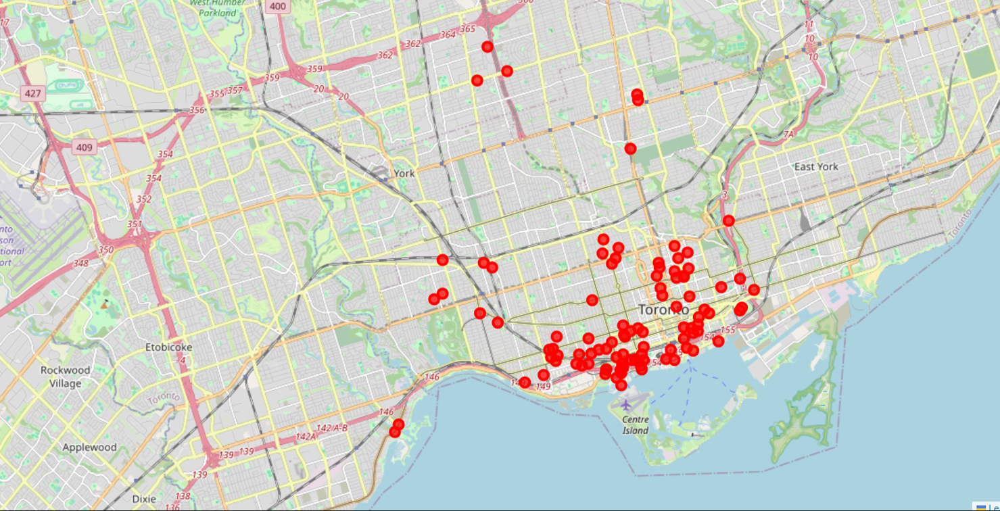

📌 Project Overview

Designed and implemented a scalable end-to-end data pipeline to predict bike theft risk in Toronto using Lambda Architecture.

📂 Dataset

Source: Toronto Open Data

Records: 39K → 31K after cleaning

Time Range: 1975–2025

This system combines:

📊 Batch analytics for historical insights

⚡ Real-time streaming for instant predictions

🤖 Machine learning for risk classification

➡️ Outcome: Enables data-driven policing strategies and a real-time risk prediction app for users

🎯 Business Impact
- Identified high-risk theft zones (Downtown waterfront, condos)
- Discovered peak theft window (nighttime)
- Highlighted misalignment in policing strategies
- Proposed targeted patrol optimization (6 PM – Midnight)

🏗️ Architecture (Lambda Design)

Add your architecture diagram below 👇

🔹 Key Design
- Cold Path (Batch): Historical processing + model training
- Hot Path (Streaming): Real-time inference pipeline
- Serving Layer: MongoDB for fast access to predictions

# 📊 Data Visualizations

## 🕒 Theft by Time  of Day

## 🕒 Theft by Hour of Day

## 🏢 Theft by Location Type

## 📍 Geographic Hotspots

⚙️ Tech Stack

| Category | Tools  | 
|---|---|
| Big Data | Apache Spark, PySpark | 
| Streaming, Col 1 | Row 2, Col 2 |

Category	Tools
Big Data	Apache Spark, PySpark
Streaming	Spark Structured Streaming
Machine Learning	Random Forest (Scikit-learn / Spark ML)
Databases	MongoDB (NoSQL), SQLite (RDBMS)
Environment	Ubuntu, Oracle VirtualBox
Data Source	Toronto Open Data
🤖 Machine Learning
Model Comparison
Model	Accuracy	Issue	Status
Model A (with location)	100%	Data Leakage	❌ Rejected
Model B (no location)	88.76%	Generalizable	✅ Deployed
🔍 Key Insight

Perfect accuracy ≠ good model
➡️ Removing location features improved real-world reliability

🔄 Real-Time Simulation

To validate scalability, a clickstream simulator was built using PySpark:

25,000+ simulated user events
Realistic behavioral patterns
Time-based event generation
Stress-tested streaming pipeline
🧠 Key Features
📍 Neighborhood Risk Segmentation (Quantiles)
⏰ Temporal Feature Engineering (Time Buckets)
🚲 High-Cardinality Reduction (Top-N encoding)
⚡ Real-Time Risk Prediction API-ready pipeline

🚀 Why This Project Stands Out

✔ End-to-end pipeline (data → ML → streaming → serving)
✔ Real-world problem with actionable insights
✔ Handles both batch + real-time workloads
✔ Demonstrates data engineering + ML + analytics
✔ Addresses data leakage (advanced ML concept)

📸 Application Concept

Add your app mockup here

“Bike Guard” App

Users input bike details + location
System returns instant theft risk level
Designed for simplicity + real-world usability

🧪 Key Learnings
Data quality directly impacts ML performance
Feature selection is critical for generalization
Lambda Architecture enables scalable hybrid systems
Real-time systems require trade-offs between latency and accuracy

👤 Author

Afeena
Master’s in Business Analytics & AI
💼 Transitioning into Data Analytics / Data Engineering
